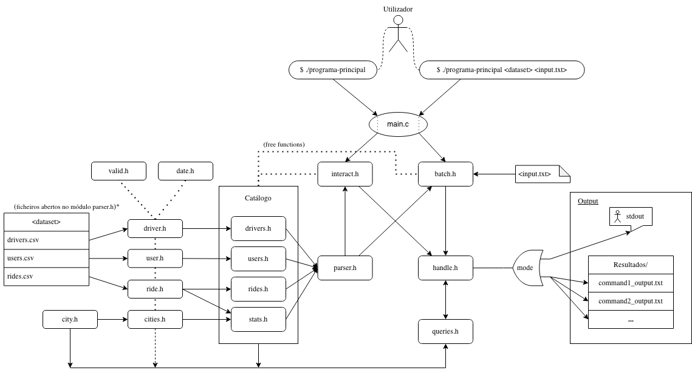

[](https://github.com/migueltc13/projeto-LI3/actions/workflows/auto_testing.yml)
[](https://github.com/migueltc13/projeto-LI3/actions/workflows/valgrind.yml)

# Projeto LI3

- [enunciado.pdf](trabalho-pratico/enunciado.pdf)

<!--
<details>
<summary><b>TODO list</b></summary>

<br>

- [ ] Queries 
  - [ ] Q2, Q3
    - [ ] sort **active** users/drivers only
  - [x] Q7
    - [x] added driver_aval struct to driver.c (encapsulamento de dados)
    - [x] update insert_city (cities.c) function to add drivers by city
    - [x] sort drivers by avaliation for each city
    - [x] (queries.c) retrieve N drivers for a specific city
  - [x] Q8
  - [x] Q9

<br>

- [x] Data validation
  - [x] Dates
    - [x] birth_date (User + Driver)
    - [x] account_creation (User + Driver)
    - [x] date (Ride)
  - [x] car_class (Driver)
  - [x] account_status (User + Driver)
  - [x] distance (Ride)
  - [x] score_user
  - [x] score_driver
  - [x] tip
  - [x] Empty cells
    - [x] Driver: id, name, gender, license_plate, city;
    - [x] User: username, name, gender, pay_method;
    - [x] Ride: id, driver, user, city;

<br>

- [ ] Memory Optimization
  - [ ] Free all memory allocated
  - [x] Shrink data inside structs
    - [x] `char* account_status;` > `char account_status;`
    - [x] `char* car_class;` > `char car_class;`
  - [x] Free dates
  - [x] Valgrind and others

<br>

- [x] Relatório fase 2
- [x] Esquema para [Arquitetura do projeto](#arquitetura-do-projeto)

</details>
-->

## Arquitetura do projeto

[](.github/img/diagram.svg)

## Relatórios

- [relatorio-fase1.pdf](trabalho-pratico/relatorio-fase1.pdf)
- [relatorio-fase2.pdf](trabalho-pratico/relatorio-fase2.pdf)

## Requerimentos

- [glib2](https://docs.gtk.org/glib/index.html) para manipulação das coleções de dados;

<details>
  <summary>Instalação</summary>

  ```sh
  apt install gcc make libglib2.0-dev libgtk2.0-dev gdb valgrind -y
  ```

</details>

## Utilização

```sh
cd trabalho-pratico/
make
```

### Modo Batch:

```sh
./programa-principal <dir_with_csvs> <input_file_path> 
```

### Modo Interativo:

```sh
./programa-principal
```

<details open>
  <summary>Exemplo de utilização</summary>

```
Enter dataset path: dataset
Number of drivers parsed: 10000
Number of users parsed:  100000
Number of rides parsed: 1000000
$ 1 SaCruz110
Santiago Cruz;M;31;3.200;5;50.340
$ 3 2    
Anita-PetPinto38;Anita-Petra Pinto;240
REsteves70;Raquel Esteves;234
$ 4 Braga
10.062
$ (Ctrl + D) 
Exit with success
```

</details>

## Testagem

### programa-testes:

```sh
make programa-testes
./programa-testes <dir_with_csvs> <dir_with_input_and_outputs>
```

<details open>
  <summary>Exemplo de output</summary>

```
Teste de desempenho - Parsing dos dados
Number of drivers parsed: 10000
Number of users parsed:  100000
Number of rides parsed: 1000000
Parsing data time: 4.11s

Teste de desempenho - Avaliação de queries
Query 1 | 0.00000075s | "1 SaCruz110"
Query 2 | 0.00000800s | "2 50"
Query 3 | 0.00000600s | "3 50"
Query 4 | 0.00000025s | "4 Braga"
Query 5 | 0.01275250s | "5 01/01/2021 01/02/2021"
Query 6 | 0.02461975s | "6 Porto 01/01/2021 01/02/2021"
Query 7 | 0.00000700s | "7 50 Lisboa"
Query 8 | 0.00283650s | "8 M 12"
Query 9 | 0.01340325s | "9 01/01/2021 01/02/2021"

Teste funcional - Validação de queries
command1_output.txt:	Pass ✔
command2_output.txt:	Pass ✔
command3_output.txt:	Pass ✔
command4_output.txt:	Pass ✔
command5_output.txt:	Pass ✔
command6_output.txt:	Pass ✔
command7_output.txt:	Pass ✔
command8_output.txt:	Pass ✔
command9_output.txt:	Pass ✔
command10_output.txt:	Pass ✔
command11_output.txt:	Pass ✔
command12_output.txt:	Pass ✔
command13_output.txt:	Pass ✔
command14_output.txt:	Pass ✔
command15_output.txt:	Pass ✔
command16_output.txt:	Pass ✔
command17_output.txt:	Pass ✔
command18_output.txt:	Pass ✔
command19_output.txt:	Pass ✔

malloc_stats
Arena 0:
system bytes     =  550182912
in use bytes     =  550137440
Total (incl. mmap):
system bytes     = 1071362048
in use bytes     = 1071316576
max mmap regions =         30
max mmap bytes   =  588943360

malloc_stats after freeing memory
Arena 0:
system bytes     =  550182912
in use bytes     =  259894208
Total (incl. mmap):
system bytes     = 1021255680
in use bytes     =  730966976
max mmap regions =         30
max mmap bytes   =  588943360
```

</details>
  
## Debug

```sh
make debug
```

### [GDB](https://www.sourceware.org/gdb/)

```sh
gdb ./programa-principal
```

### [Valgrind](https://valgrind.org/)

```sh
valgrind ./programa-principal <dir_with_csvs> <input_file_path>
```

### Time

```sh
command time -v ./programa-principal <dir_with_csvs> <input_file_path>
```

### Memusage

```sh
memusage ./programa-principal <dir_with_csvs> <input_file_path>
```
